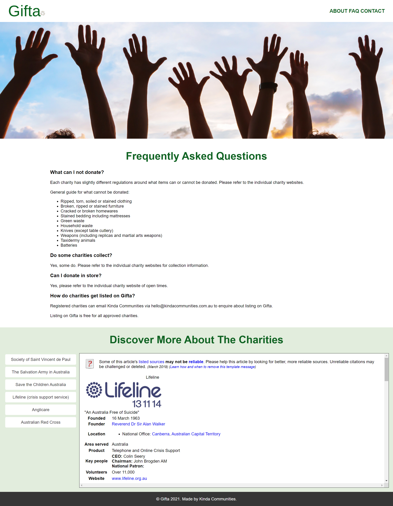

# Gifta
## Description
This repository contains Gifta - a powerful yet simple charity locator which suggests nearby not-for-profit organisations based on the item the user wishes to dispose of. Gifta also provides the user with information about the charities by displaying associated Wikipedia articles within the app.

Gifta uses the *Google Maps JavaScript* and *Places* APIs to retrieve the location of charities.

Gifta uses the *MediaWiki* API to fetch articles about charities from Wikipedia.

Gifta uses the *jQuery* and *Bulma* to achieve a clean, polished and responsive UI.

When the user selects an item, a list of charities is checked to see whether they can accept that item.
Gifta then places all charities which match this criteria into a google maps API call.
The results are then displayed as markers on a map which can be clicked on to display the name and address of each charity.
The FAQ section provides further information such as which items should not be donated. Additionally, it dynamically fetches each charity's Wikipedia article (if it exists) so that it can be viewed without having to leave Gifta.

A link to to Gifta's launch presentation can be found here: https://docs.google.com/presentation/d/1GM2yEJ6o6y_XGO_irJIz2f-Hg8QBwigMBzaGOI47jCA/edit#slide=id.p
 

## Usage
The deployed website can be viewed here: https://dandycodes.github.io/gifta/
## Credits
https://developers.google.com/maps/

https://bulma.io/

https://api.jquery.com/

https://developer.mozilla.org/en-US/

https://www.w3schools.com/
## License
Copyright (c) DandyCodes. All rights reserved.

Licensed under the [MIT](LICENSE.txt) license.
